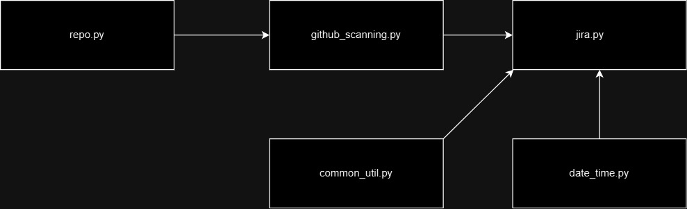

# automatically-create-github-issuea-when-advanced-scanning-detects-an-issue
Automatically created jira issues whenever there is a issue detected by CodeQL analysis

# How the code works



* repo.py --> this will retrieve all the repositories in github organization and pass it to github_scanning.py
* github_scanning.py --> basically this will retrieve the dependabot alerts from github
* jira.py --> this file is used for multiple purposes
    * retrieve all tasks under a epic
    * create task on epic with summary and description

* common_utils.py --> character limit for description and summary
    * compare tasks in epic and dependabot alters to make sure no duplicate stories are created
* date_time.py --> returns the date time


# Parameters
| parameter name | description | required |
|----------------|--------------|---------|
| epic_key | jira epic key | :heavy_check_mark: |
| organization | github organization name | :heavy_check_mark:|


# credentials used

`JIRA_PASSWORD`, `JIRA_URL`, `JIRA_USERNAME`, `GH_TOKEN` are used for authentication for `Jira` and `GitHub`


**Poetry is used for package management**

## How to run code in local

* clone the repository and `cd github-automatically-create-jira-issues-when-advanced-scanning-detects-an-issue`
* pass the necessary parameters like `epic_key` and `organization` name

```commandline
python3 jira.py --epic_key DEVOPS-245 --organization devwithkrishna 
```